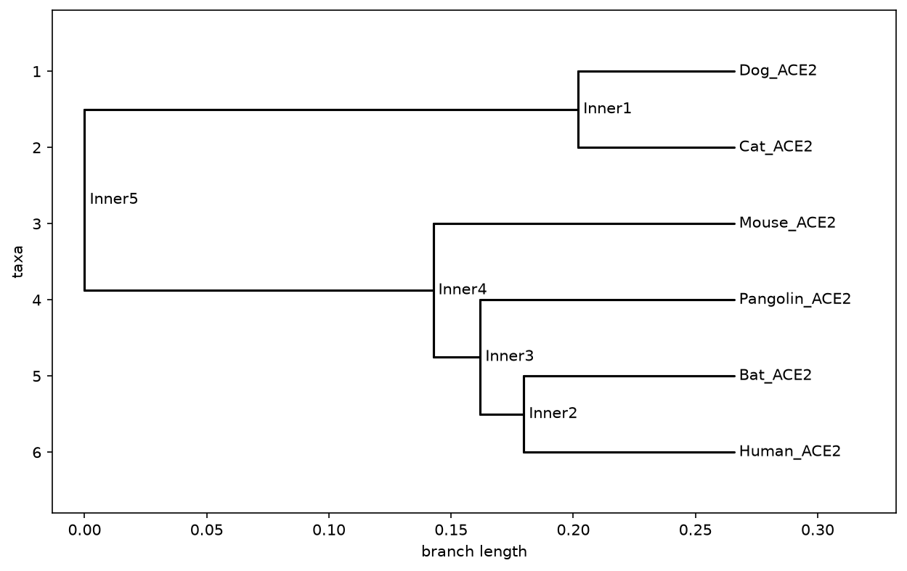

# ACE2 Cross-Species Phylogenetic Tree

A Python tool that compares the ACE2 gene across multiple species and builds a phylogenetic (family) tree showing how similar or different each species' version is.

## Background

ACE2 (Angiotensin-Converting Enzyme 2) is a human cell-surface protein best known as the receptor SARS-CoV-2 uses to enter cells. Because ACE2 sequence differs slightly between species, its similarity (or difference) helps explain why some animals are more or less susceptible to the virus. This is a well-studied comparative genomics question with real public health relevance.

This tool automates the core comparative genomics workflow: given ACE2 sequences from several species, it aligns them, calculates pairwise similarity, and builds a tree showing evolutionary relationships using UPGMA clustering.

## Results

Sequences from six species were compared: human, cat, dog, mouse, bat (Rhinolophus sinicus) and pangolin (Manis javanica) — species relevant to the SARS-CoV-2 origin discussion, since ACE2 is the receptor the virus uses to enter cells. The resulting tree grouped bat, pangolin, and human ACE2 together on one branch, separate from cat, dog, and mouse on another — loosely consistent with the widely discussed bat-to-pangolin-to-human transmission hypothesis, though this simple pairwise-similarity method is a coarse approximation rather than a rigorous phylogenetic analysis (a proper multiple sequence alignment tool such as MAFFT would be a natural next refinement).




## How to use it

1. Download ACE2 mRNA sequences for several species from NCBI (Human, Cat, Dog, Bat, Pangolin, Mouse are commonly compared in the literature).
2. Combine them into a single FASTA file, with a clear species name in each header line (see `example_multi_species.fasta`).
3. Run:

```
   python ace2_phylogenetic_tree.py ace2_multi_species.fasta
   ```

4. The tool prints the tree to the screen and saves:

   * `tree.txt` — a text diagram of the tree
   * `tree.png` — an image of the tree

## Tools/skills used

Python, Biopython, pairwise sequence alignment, UPGMA phylogenetic clustering, matplotlib.

## What this tool does NOT do (yet)

This uses simple pairwise alignment distances rather than a full multiple sequence alignment (e.g., via MAFFT or Clustal), which more rigorous phylogenetic studies would use. A natural next step would be integrating a proper MSA tool before tree-building.

